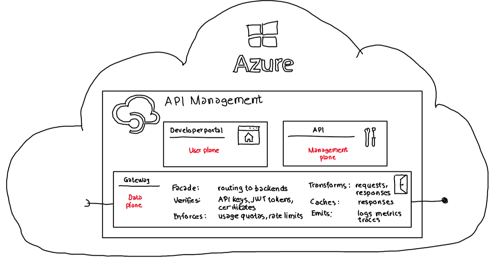
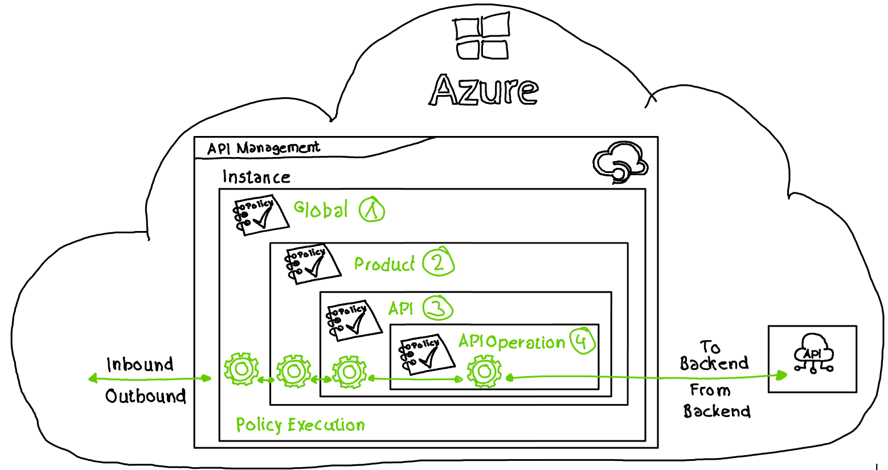
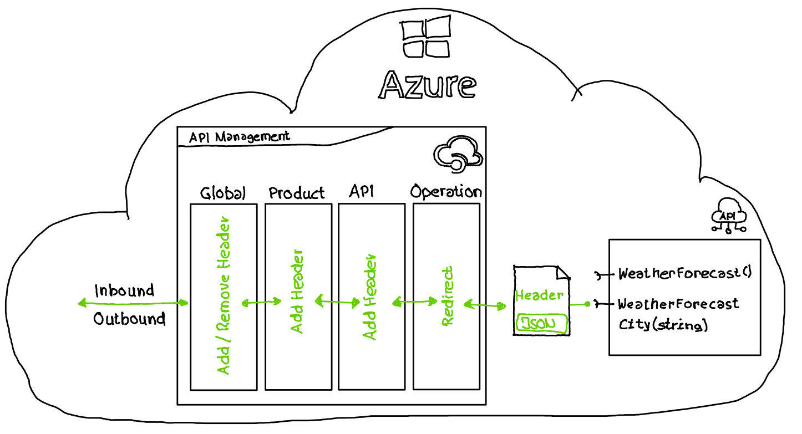

# Azure API Management (APIM) - Azure CLI policy support

## tl;dr

The Azure CLI provides not yet functionality to create and maintain policies within APIM. This example shows how the Azure CLI can be used to create and maintain APIM policies by using the Azure REST API directly.

- [Sample Azure CLI Rest call](src/CreateEnv/CreateEnv.azcli): Check Step 13
- [Sample payload (policy) files](src/CreateEnv/Policies/) to create / list policies on global, product, API and API operation level.

## Azure API Management

Azure API Management is a fully managed service offered by Microsoft that makes it easy to create, publish, and manage APIs (Application Programming Interfaces) for any back-end service. It provides a platform for developers to create, secure, and publish APIs to external and internal customers. Azure API Management acts as a gateway between an API and its consumers, handling security, rate limiting, caching, and other common API management tasks.



APIM components:

- Developer portal:  
  The user plane provides functionality for API consumers to explore provided APIs
- Gateway:  
  The data plane in Azure API Management refers to the components and services responsible for handling incoming requests from API consumers, routing the requests to the back-end services, and returning the responses to the consumers.

  The data plane is responsible for executing the policies that are defined in the Azure API Management configuration, such as authentication, rate-limiting, caching, and transformation. These policies are applied to incoming requests and outgoing responses to ensure that the API management service can control access to the back-end services, manage the performance and reliability of the API, and ensure that the API returns data in the correct format.
- API:  
  The management plane in Azure API Management provides the functionality to manage the configuration, policies, and metadata associated with APIs. It is the part of the service that allows administrators to create and manage the APIs, configure security policies, and set up usage plans and billing. The management plane is accessed through the Azure portal, ARM or bicep templates and the Azure CLI.

  ***The Azure CLI does not yet provide functionality to manage policies within Azure API Management. This example shows how the Azure CLI can be used to create and maintain APIM policies by using the Azure REST API directly.***

## Policies in Azure API Management

### Policy format

When an incoming request to an API is received or when a response from the back-end service is returned. Policies allow administrators to control and manipulate the behavior of APIs, making it easier to manage the performance and security of the APIs.

Policies in Azure API Management are defined in an XML format:

```XML
<policies>
    <inbound>
        <!-- statements to be applied to the request -->
    </inbound>
    <backend>
        <!-- statements to be applied before the request is forwarded to 
         the backend service -->
    </backend>
    <outbound>
        <!-- statements to be applied to the response -->
    </outbound>
    <on-error>
        <!-- statements to be applied if there is an error condition -->
    </on-error>
</policies>
```

### Policy definition

Policies in Azure API Management can be defined on 4 different scopes:



1. **Global**:  
  Applies to all APIs that are managed by the API Management service, regardless of the API that is being called. These policies are executed first and provide a way to implement common functionality across all APIs.

2. **Product**:  
  Applies to a specific product within the API Management service. A product in Azure API Management is a collection of one or more APIs that are made available to developers or end-users.

3. **API**:  
  Applies to a specific API within an APIM product. Policies that are defined at the API scope are executed for all API requests that are made to the specific API. Multiple single API operations are grouped in an API. 

4. **API operation**:  
  The most specific level of configuration that determines the scope and applicability of policies. The operation scope in Azure API Management applies to a specific operation within an API.

## Demo scenario

### Overview



- A simplified .NET Core application provides a REST API with two methods.
- The two methods are imported into Azure API Management as an API
- Policies
  - **API operation scope**:  
    all calls to `WeatherForecast()`is redirected to `WeatherForecastCity(string city)` where `City == "Munich"`
  - **API scope**:  
    the header `APIM-APIScopePolicy` with value `"Added on Api level"` will be added
  - **Product scope**:  
    the header `APIM-ProductScopePolicy` with value `"Added on Product Level"` will be added
  - **Global (all APIs) scope**:  
    the header `APIM-AllApiScopePolicy` with value `"Added on global level (all apis)"` will be added and the header `APIM-Source-System` provided by the .NET Core application will be removed.

### .NET Core application

The simplified .NET Core application which provides a RESTful interface with two methods can be found [here](src/APIM.Service/)

The controller class providing the two methods can be found [here](src/APIM.Service/Controllers/WeatherForecastController.cs)

### Step by step guidance

A step by step guidance to create the whole demo environment, including an Azure API Management instance, a Azure Web App hosting the .NET core RESTful API as well as all necessary policy operations can be found [here](/src/CreateEnv).
